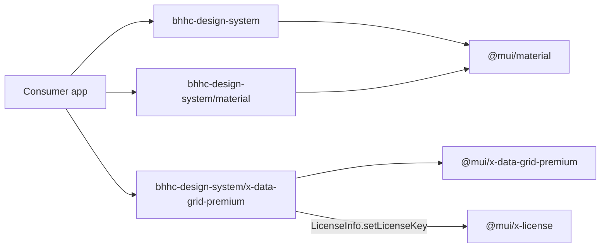

# MUI replacement library (`bhhc-design-system`)

This repo today is a Vite + Storybook app on React 19 with custom HTML [Button](src/components/Button/Button.tsx) and [Card](src/components/Card/Card.tsx). The work is to make it a **drop-in replacement** for MUI Material, MUI Core, and MUI X, **developed on React 18** and **consumable on React 18+**, published as **`bhhc-design-system`**.



Consumer imports mirror MUI package names with the `@mui/` prefix dropped:

```ts
import { Button, TextField } from 'bhhc-design-system';
import { Button } from 'bhhc-design-system/material';
import { DataGridPremium } from 'bhhc-design-system/x-data-grid-premium';
import { LineChart } from 'bhhc-design-system/x-charts-premium';
```

## Subpath export map

Each published export is a thin `export * from '<mui-package>'` module. Root and `/material` are the same Material entry, with Button and Card overridden. Data Grid override lives on `x-data-grid-premium`.

- `bhhc-design-system` and `bhhc-design-system/material` → `@mui/material` (Button, Card, `theme`)
- `bhhc-design-system/icons-material` → `@mui/icons-material`
- `bhhc-design-system/system` → `@mui/system`
- `bhhc-design-system/utils` → `@mui/utils`
- `bhhc-design-system/lab` → `@mui/lab`
- `bhhc-design-system/styled-engine` → `@mui/styled-engine`
- `bhhc-design-system/base` → `@mui/base` (legacy unstyled; still a public Core package)
- `bhhc-design-system/base-ui` → `@base-ui/react`
- `bhhc-design-system/x-data-grid` → `@mui/x-data-grid`
- `bhhc-design-system/x-data-grid-pro` → `@mui/x-data-grid-pro`
- `bhhc-design-system/x-data-grid-premium` → `@mui/x-data-grid-premium` (also export `DataGrid` as `DataGridPremium`)
- `bhhc-design-system/x-date-pickers` → `@mui/x-date-pickers`
- `bhhc-design-system/x-date-pickers-pro` → `@mui/x-date-pickers-pro`
- `bhhc-design-system/x-charts` → `@mui/x-charts`
- `bhhc-design-system/x-charts-pro` → `@mui/x-charts-pro`
- `bhhc-design-system/x-charts-premium` → `@mui/x-charts-premium`
- `bhhc-design-system/x-tree-view` → `@mui/x-tree-view`
- `bhhc-design-system/x-tree-view-pro` → `@mui/x-tree-view-pro`
- `bhhc-design-system/x-scheduler` → `@mui/x-scheduler`
- `bhhc-design-system/x-scheduler-premium` → `@mui/x-scheduler-premium`
- `bhhc-design-system/x-license` → `@mui/x-license`

Implementation: one source file per subpath under `src/exports/` (for example `src/exports/x-data-grid-premium.ts`), plus `package.json` `"exports"` pointing at the matching `dist` files. Do not barrel every X package from the root — that would break the MUI-style import contract and hurt tree-shaking.

## Dependency layout (conflicts + size)

Treat this package as the **only** MUI / Base UI install consumers need. **All public Core and X packages are direct `dependencies`** (Community, Pro, and Premium), even when one is a superset of another, so every subpath has a matching installed package and Vite can externalize it by name.

### React 18+ consumers, React 18 in this repo

- **This repo:** pin `react`, `react-dom`, `@types/react`, and `@types/react-dom` to **18.x** (downgrade from `^19`). No React 19-only APIs. If Storybook 10 requires React 19, pin Storybook to a React-18-compatible version.
- **Published peerDependencies:** `"react": "^18.0.0 || ^19.0.0"` and the same for `react-dom`. Optional peer `@types/react` / `@types/react-dom` with the same range.
- React stays a **peer**, not a dependency.

### dependencies (installed for consumers, not bundled into `dist`)

**Emotion (required by Material):** `@emotion/react`, `@emotion/styled`

**Base UI:** `@base-ui/react`

**MUI Core (public):** `@mui/material`, `@mui/icons-material`, `@mui/system`, `@mui/utils`, `@mui/types`, `@mui/lab`, `@mui/styled-engine`, `@mui/private-theming`, `@mui/base`

**MUI X (all public Community / Pro / Premium packages):** `@mui/x-data-grid`, `@mui/x-data-grid-pro`, `@mui/x-data-grid-premium`, `@mui/x-date-pickers`, `@mui/x-date-pickers-pro`, `@mui/x-charts`, `@mui/x-charts-pro`, `@mui/x-charts-premium`, `@mui/x-tree-view`, `@mui/x-tree-view-pro`, `@mui/x-scheduler`, `@mui/x-scheduler-premium`, `@mui/x-license`

**Skip (not Core/X public runtime libs):** `@mui/internal-*`, `@mui/docs`, `@mui/codemod`, `@mui/envinfo`, `@mui/joy`, `@mui/material-nextjs`, `@mui/styles` (legacy JSS), `@mui/material-pigment-css`, `@mui/x-data-grid-generator` (dev-only).

**devDependencies:** Storybook/Vite/TypeScript; `vite-plugin-dts`.

### Vite library config

[vite.lib.config.ts](vite.lib.config.ts) must treat every listed package as **external** so they are not inlined into `dist`:

```ts
external: (id) =>
  id === 'react' ||
  id === 'react-dom' ||
  id.startsWith('react/') ||
  id.startsWith('react-dom/') ||
  id.startsWith('@mui/') ||
  id.startsWith('@emotion/') ||
  id.startsWith('@base-ui/')
```

- `build.lib.entry` is a **multi-entry object** keyed by subpath (`index` / `material`, `x-data-grid-premium`, `base-ui`, …).
- Formats: ESM only (this package is `"type": "module"`).
- `vite-plugin-dts` emits types per entry so `bhhc-design-system/x-charts-premium` has matching `.d.ts`.
- `"sideEffects"` includes the compiled license module so signing is not tree-shaken away.

Getting started will tell consumers to **remove** `@mui/*`, `@emotion/*`, and `@base-ui/react` from their own `package.json`.

## MUI X signing at build time

Requirement “package signing” is **MUI X license injection**, not npm provenance.

1. Gitignored `.env` plus `.env.example` with `MUI_X_LICENSE_KEY=`.
2. [src/license.ts](src/license.ts) calls `LicenseInfo.setLicenseKey()` from `@mui/x-license`.
3. Library Vite config inlines the key at **build**. `build:lib` **fails** if the key is missing.
4. Every published entry (Material and each X/Base subpath) imports `./license` first so consumers never call `setLicenseKey`, regardless of which subpath they import.

The key **will be present in the published JS**. That is expected for a private internal package; it must not be committed to git.

## Overrides (Button, Card, Data Grid)

**Button / Card** (Material entry only): wrap MUI primitives with **native MUI props** (`label` / `eyebrow` go away). BHHC look via [src/theme.ts](src/theme.ts) (`createTheme`: primary `#3b5bdb`, 8px/12px radii). `forwardRef` + spread MUI props. Delete [Button.css](src/components/Button/Button.css) / [Card.css](src/components/Card/Card.css).

**DataGrid** (`x-data-grid-premium` entry): re-export `DataGridPremium` as `DataGrid` in addition to `export *` from `@mui/x-data-grid-premium`. Community and Pro grid subpaths stay unmodified re-exports.

**Theme:** export `theme` from the Material entry. Storybook [preview.tsx](.storybook/preview.tsx) and [App.tsx](src/App.tsx) wrap with `ThemeProvider` + `CssBaseline`.

## Library publish setup

- [package.json](package.json): `"name": "bhhc-design-system"`, `"private": false`, `"files": ["dist"]`, full `"exports"` map for every subpath above (plus `"./package.json"`).
- `publishConfig.registry` placeholder until the internal registry URL is known.
- Scripts: `build:lib`; `prepublishOnly` runs `build:lib`.
- TypeScript: dts per entry; do not break Storybook’s `noEmit` app tsconfig.

## Storybook and consumer docs

- Update Button/Card stories to MUI APIs; add DataGrid stories importing from the premium subpath.
- Getting started (Storybook MDX + [GETTING_STARTED.md](GETTING_STARTED.md)): React 18 or 19; install `bhhc-design-system`; import from `bhhc-design-system` / `bhhc-design-system/material` / `bhhc-design-system/x-*`; no `LicenseInfo` in the app; date pickers still need `LocalizationProvider` + a date library in the consumer app.
- Update [HowToUse.mdx](src/docs/HowToUse.mdx) and [README.md](README.md).

## Out of scope unless you ask

- Internal registry URL.
- Committing the actual license key.
- npm provenance / GPG signing of the tarball.
- One Storybook story per MUI component.
- Deep path re-exports such as `@mui/material/Button` → `bhhc-design-system/material/Button` (package-level subpaths only, matching the request).
